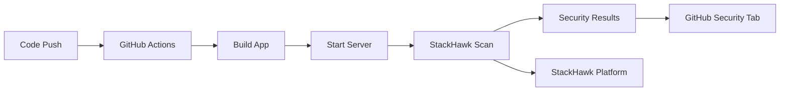

# StackHawk Security Scanning Setup

StackHawk provides Dynamic Application Security Testing (DAST) for AuthorMagic.com, automatically scanning for vulnerabilities in our running Next.js application.

## 🔒 **What is DAST?**

Dynamic Application Security Testing (DAST) tests your running application by:

- **Crawling your app** like a real user would
- **Testing authenticated routes** with Clerk integration
- **Finding vulnerabilities** in real-time (OWASP Top 10 and more)
- **Integrating with CI/CD** for continuous security testing

## 🚀 **Quick Start**

### 1. **StackHawk Platform Setup**

1. **Create Account**: Sign up at [app.stackhawk.com](https://app.stackhawk.com)
2. **Generate API Key**: Go to Settings > API Keys
3. **Create Application**: Create a new application to get your Application ID

### 2. **Environment Variables**

Add these to your `.env.local` for local development:

```bash
# StackHawk Configuration
HAWK_API_KEY=hawk.your_api_key_here
HAWK_APPLICATION_ID=your_application_id_here

# Optional: Test User Credentials for Authenticated Scanning
HAWK_TEST_USERNAME=test@example.com
HAWK_TEST_PASSWORD=your_test_password
```

### 3. **GitHub Secrets**

Add these secrets to your GitHub repository (Settings > Secrets and variables > Actions):

```
HAWK_API_KEY = your_stackhawk_api_key
HAWK_APPLICATION_ID = your_application_id
HAWK_PROD_TEST_USERNAME = production_test_user@example.com
HAWK_PROD_TEST_PASSWORD = production_test_password
```

## 📁 **Configuration Files**

### **stackhawk.yml** (Development)

```yaml
app:
  applicationId: ${HAWK_APPLICATION_ID}
  env: Development
  host: http://localhost:3000

hawk:
  failureThreshold: high
  spider:
    maxDurationMinutes: 10
    ajax: true
    maxDepth: 3

authentication:
  loggedInIndicator: 'Sign Out'
  loginPath: /sign-in
  testPath: /dashboard
  # ... (see full config in file)
```

### **stackhawk-prod.yml** (Production)

- Targets `https://authormagic.com`
- Stricter `failureThreshold: low`
- Longer scan duration (20 minutes)
- More comprehensive route coverage

## 🛠️ **Available Commands**

### **Local Development**

```bash
# Install StackHawk CLI first (one-time setup)
npm install -g @stackhawk/cli
# OR use the installer from: https://docs.stackhawk.com/stackhawk-cli/

# Initialize StackHawk (one-time setup)
npm run security:hawk:init

# Validate configuration
npm run security:hawk:validate

# Run security scan on running app
npm run security:hawk:scan

# Quick local scan (starts dev server, scans, stops server)
npm run security:hawk:local
```

### **CI/CD Integration**

Security scans automatically run on:

- ✅ **Push to main branch**
- ✅ **GitHub Actions CI pipeline**
- ✅ **Results appear in GitHub Security tab**

## 🔐 **Authentication Testing**

StackHawk can test your Clerk-protected routes by:

1. **Logging in** using configured test credentials
2. **Detecting authentication state** via "Sign Out" indicator
3. **Testing protected routes** like `/dashboard`, `/profile`, `/settings`
4. **Following authenticated navigation** throughout your app

### **Setting Up Test User**

1. **Create a test user** in Clerk dashboard:

   ```
   Email: test@example.com
   Password: SecureTestPassword123!
   ```

2. **Add credentials to environment**:

   ```bash
   HAWK_TEST_USERNAME=test@example.com
   HAWK_TEST_PASSWORD=SecureTestPassword123!
   ```

3. **Verify test routes work**:
   - User can access `/dashboard`
   - User sees "Sign Out" when logged in
   - User gets redirected to `/sign-in` when logged out

## 📊 **Understanding Scan Results**

### **Severity Levels**

- 🔴 **High**: Critical vulnerabilities requiring immediate attention
- 🟡 **Medium**: Important issues that should be addressed
- 🟢 **Low**: Minor issues or best practice recommendations

### **GitHub Integration**

- **Security Tab**: View all findings in GitHub's Security tab
- **Pull Request Checks**: Scans run automatically on PRs
- **Code Scanning Alerts**: Detailed vulnerability information
- **SARIF Reports**: Machine-readable security findings

### **StackHawk Platform**

- **Detailed Reports**: Full vulnerability analysis
- **Reproduction Steps**: How to recreate each finding
- **Fix Guidance**: Specific remediation advice
- **Trend Analysis**: Security improvements over time

## 🔧 **Configuration Options**

### **Failure Thresholds**

```yaml
hawk:
  failureThreshold: high # Only fail on critical issues
  # failureThreshold: medium  # Fail on medium+ issues
  # failureThreshold: low     # Fail on any security issue
```

### **Route Inclusion/Exclusion**

```yaml
spider:
  includePaths:
    - '/api/*' # Test all API endpoints
    - '/dashboard/*' # Test authenticated routes
    - '/admin/*' # Test admin functionality

  excludePaths:
    - '/_next/*' # Skip Next.js internals
    - '*.css' # Skip static assets
    - '/sign-in*' # Skip auth pages
```

### **Performance Tuning**

```yaml
hawk:
  spider:
    maxDurationMinutes: 10 # Scan duration limit
    maxDepth: 3 # How deep to crawl
    ajax: true # Follow AJAX requests

hawkAddOn:
  memory: '2g' # Scanner memory allocation
```

## 🚨 **Troubleshooting**

### **Common Issues**

**❌ "Application not responding"**

```bash
# Solution: Make sure your dev server is running
npm run dev
# Wait for server to start, then run scan
npm run security:hawk:scan
```

**❌ "Authentication failed"**

```bash
# Solution: Verify test credentials
echo $HAWK_TEST_USERNAME
echo $HAWK_TEST_PASSWORD
# Make sure user exists in Clerk and can log in manually
```

**❌ "Scan timeout"**

```yaml
# Solution: Reduce scan scope in stackhawk.yml
hawk:
  spider:
    maxDurationMinutes: 5 # Reduce from 10
    maxDepth: 2 # Reduce from 3
```

**❌ "No routes found"**

```yaml
# Solution: Check includePaths configuration
spider:
  includePaths:
    - '/*' # Include all routes
```

### **Debug Mode**

```bash
# Run with debug output
hawk scan --debug --verbose
```

### **Validation Commands**

```bash
# Validate configuration file
hawk validate config

# Validate authentication setup
hawk validate auth

# Test API connectivity
hawk validate api
```

## 📚 **Additional Resources**

### **StackHawk Documentation**

- [Getting Started Guide](https://docs.stackhawk.com/getting-started/)
- [Next.js Integration](https://docs.stackhawk.com/continuous-integration/github-actions/)
- [Authentication Setup](https://docs.stackhawk.com/hawkscan/authenticated-scanning/)
- [Configuration Reference](https://docs.stackhawk.com/hawkscan/configuration/)

### **CLI Installation**

- [macOS/Linux/Windows Instructions](https://docs.stackhawk.com/stackhawk-cli/)
- [Homebrew Installation](https://docs.stackhawk.com/stackhawk-cli/#install-with-homebrew-macos)

### **GitHub Integration**

- [Code Scanning Setup](https://docs.stackhawk.com/continuous-integration/github-actions/github-code-scanning/)
- [Security Tab Integration](https://docs.github.com/en/code-security/code-scanning)

---

## 🎯 **Best Practices**

1. **Run scans regularly** - Integrate into CI/CD pipeline
2. **Test authenticated routes** - Most vulnerabilities are in protected areas
3. **Review findings promptly** - Address high-severity issues immediately
4. **Monitor trends** - Track security improvements over time
5. **Keep configs updated** - Adjust as your application evolves

## 🔄 **Workflow Integration**



**Ready to scan?** Run `npm run security:hawk:local` to test your setup!
